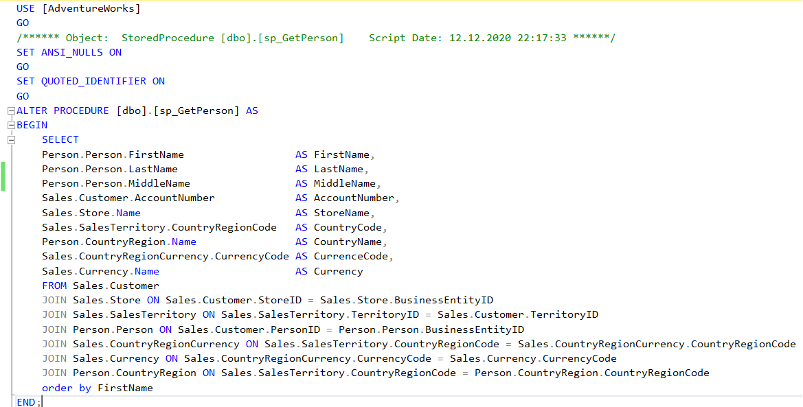
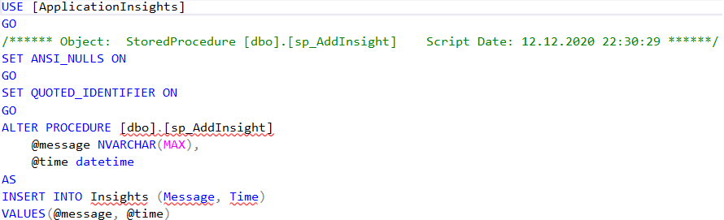
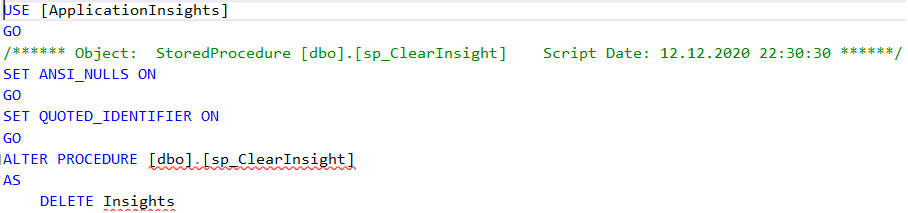
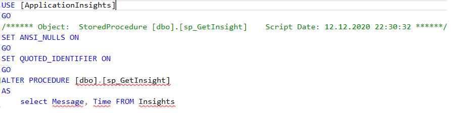
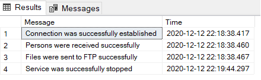
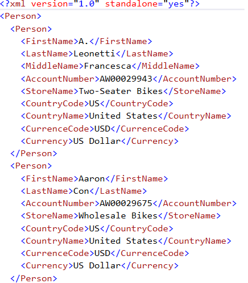

## Описание программы ##
Данная лабораторная работа представляет собой две службы работающие параллельно. Первая служба - служба `FileWatcher`, разработанная в лаборатрной работе №3. 
Вторая служба `DataManager`. Ее разработка и была задачей данной лабораторной. При разработке данной службы использовалась база данных `AdwantureWorks`.
Давайте подробнее рассмотрим алгоритм работы.

## Алгоритм работы программы ##
1. Запускаем службу `FileWatcher`, разработанную в лабораторной работе №3
2. Запускаем службу `DataManager`
3. Службы получают необходимые настройки из `Xml` и `Json` файлов
4. Далее происходит извлечение данных из базы данных `AdwantureWorks`
5. На основе этих данных генерируются Xml и Xsd файлы 
6. Далее эти файлы отправляются в папку SourceDirectory, где они шифруются и архивируются
7. С помощью службы FileWatcher полученные файлы отправляются в TargetDirectory, где происходит дешифрование и разархивация
8. Все действия, в том числе и исключения логируются и записываются в разработанную мной базу данных ApplicationInsights, также дополнительно исключения записываются в файл Exception.txt  
9. Завершение работы FileWatcher и DataManager

## Программная реализация ##

### SQL: ###
Я собрала таблицу из 6 отношений, которые связаны между собой внешним ключем.
Так мы получили таблицу продемонстрированную ниже

Затем мы создали хранимую процедуру sp_GetPerson, которая делает запрос к нашей базе данных (работает с отношениями)

Мы используем хранимые процедуры, т.к. процедура упрощает управление кодом.Также хранимые процедуры позволяют ограничить доступ к данным в таблицах и тем самым уменьшить вероятность преднамеренных или неосознанных нежелательных действий в отношении этих данных. И еще один важный аспект - производительность. Хранимые процедуры обычно выполняются быстрее, чем обычные SQL-инструкции.

Далее создали базу данных ApplicationInsights. И необходимые для нее хранимые процедуры sp_AddInsight, sp_ClearInsight, sp_GetInsight.
Процедура sp_AddInsight отвечает за добавление данных в таблицу Insight базы даннах ApplicationInsights.

Процедура sp_ClearInsight отчищает таблицу Insight

Процедура sp_GetInsight получает данные из таблицы Insight

Во время работы службы все действия и исключения логируются и записываются в таблицу Insight

### .NET(C#): ###
Точкой входа в приложение является класс Program.cs. В нем происходит составление конфигурации и собственно запуск DataManager. Здесь также осуществляется подключение к БД, используемым в дальнейшем в лабораторной работе.
Ввиду того, что службы FileWatcher и DataManager работают одновременно и получают конфигуриции предоставленные в виде JSON и XML файлов с помощью класса ConfigurationManager  из разработанного в 3 лаборатоной работе пакета, то для более удобного использования класс ConfigurationManager, а также парсеры XML и JSON были перенесены в отдельное пространство имен ServiceLib. ServiceLib мы подключили в обе службы.
Работа с базой данных осуществляется с помощью класса DataOptions, рассмотрим его более подробно.
ConnectionString - строка для подключения базы данных
LoggerConnectionString- строка для подключения базы данных ApplicationInsights
SourcePath - путь к папке SourceDirectory(нашему FTP серверу)
TargetFolder - путь к папке TargetDirectory

Также для работы с базами данных были разработаны классы DataIo (в данном классе используются хранимые процедуры для работы с базами данных ApplicationInsights и AdwentureWorks. В нем осуществляется добавление, удаление и чтение данных из БД), FileTransfer (с помощью данного класса осуществляется передача XML файла на FTP сервер), а также класс XmlGenerator (генерирует Xml файл на основе полученных данных. Данный процесс происходит с использованием DataSet. Затем создается Xsd файл, который валидирует наш Xml файл)
Класс DataManager - собственно сама служба. В нем разработано событие OnStart, в котором реализована основная логика пррограммы

Для более удобного ориентирования в коде программы была разработана система папок, содержание которых составлялось согласно предназначению классов.

Пример результата составленного Xml файла

